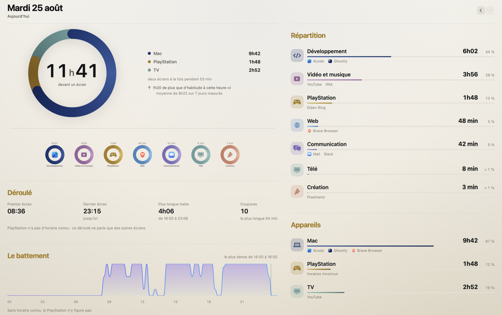
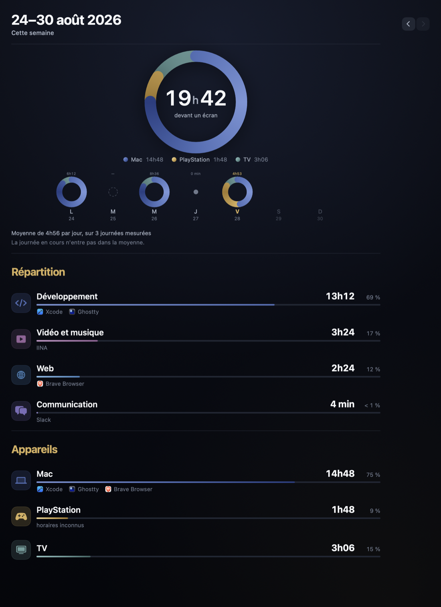
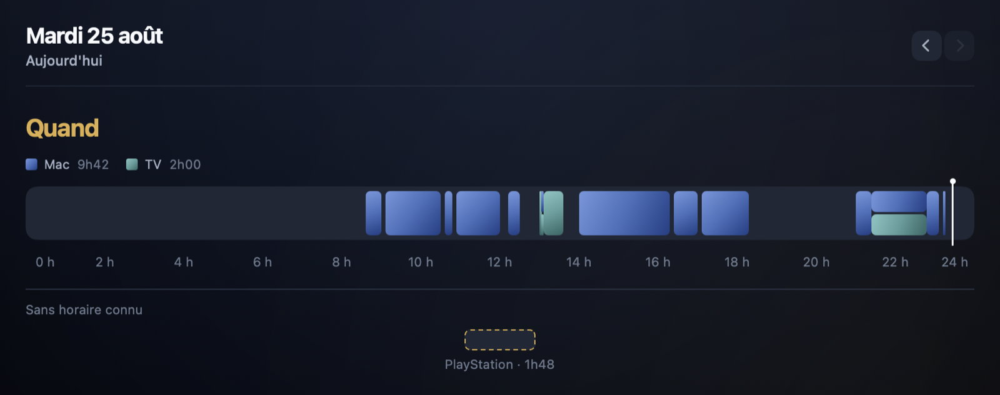

# Pulseon

> Je voulais savoir combien de temps je passe devant un écran. Pas juste mon Mac : ma télé,
> ma PS5, tout. Et je voulais une app que j'aie **envie** d'ouvrir.

Une app macOS native, écrite en Swift, que j'ai construite en binôme avec Claude entre le
14 et le 25 août 2026. C'est un projet perso — pas un exercice, pas un produit à vendre :
elle tourne sur ma machine tous les jours.

---

## Pourquoi je l'ai faite

macOS a déjà « Temps d'écran ». Le problème n'est pas qu'elle soit fausse, c'est que je ne
l'ouvre jamais. Elle est moche, elle me donne un chiffre et une liste d'apps, et surtout
elle ne connaît que mon Mac — alors que mes soirées se passent devant la télé, avec la PS5
branchée dessus.

Et puis un total tout seul ne me dit rien. « 6 h d'écran », d'accord, mais 6 h d'une traite
le matin et 6 h étalées en vingt reprises jusqu'à minuit, ce ne sont pas les mêmes journées.
Ce qui m'intéresse, c'est **quand**.

Donc l'objectif tenait en deux lignes : mesurer tous mes écrans, pas seulement l'ordinateur.
Et faire quelque chose d'assez beau pour que j'aie envie de le regarder.

---

## Le premier essai, que j'ai jeté

J'ai d'abord construit un dashboard complet en Tauri + Svelte + Python. Ça marchait. Je l'ai
abandonné le 14 août pour deux raisons : c'était lourd (un script Python, un venv, un
launchd, une webview) et ça me fermait la porte de l'iPhone.

J'ai tout repris en **Swift / SwiftUI**, une techno que je ne connaissais pas du tout. C'est
d'ailleurs une des raisons pour lesquelles j'avais envie de ce projet : apprendre en
construisant quelque chose dont je me sers vraiment, plutôt qu'en suivant un tutoriel.

Ce que j'ai gardé du premier essai : le modèle de données (des sources qui savent dire *quand*,
et des sources qui ne savent dire qu'un total), et l'idée que la donnée est le design.

---

## Ce que je voulais voir à l'écran



L'anneau, c'est ma signature. Quand la première version de l'écran de la semaine est
arrivée en graphique à colonnes, je l'ai refusée : *si c'est en colonne, autant garder
l'ancienne app*. Le rond tient les deux échelles — un grand anneau pour la semaine, sept
petits pour les journées — et c'est ce qui fait que Pulseon ressemble à Pulseon.

| | |
|---|---|
|  |  |

Un truc auquel je tiens : **l'app ne juge pas**. La première maquette avait un objectif
quotidien (« / 5h Daily Goal »), un badge « On Track », un score « objectif tenu 6 jours
sur 7 ». Je les ai tous retirés. Je veux un miroir, pas un coach. Conséquence dans le code :
l'anneau fait toujours le tour complet, ses arcs sont des parts de la journée et jamais une
progression vers un but. Rien n'est rouge non plus — le rouge dirait « trop ».

---

## La règle que je me suis donnée

> **Ne jamais afficher un chiffre que je n'ai pas mesuré.**

C'est ce qui m'a le plus servi. Ça a l'air d'un principe, c'est en fait ce qui décide de
l'architecture et de la moitié des tests.

- **« Pas branchée » n'est pas « zéro ».** Un jour où le collecteur était éteint s'affiche
  en cercle pointillé et « — ». Un vrai zéro mesuré s'affiche en point plein. Un jour à
  venir ne se dessine pas du tout. Quatre états, pas deux.
- **Je n'invente jamais un horaire.** L'API PlayStation ne donne qu'un compteur cumulé, sans
  heures. Sa durée est donc affichée hors du rail, en pointillés, sous un filet « sans
  horaire connu ». La poser à midi parce que ça remplirait mieux le dessin, ce serait mentir.
- **On tronque, on n'arrondit pas.** Afficher « 1 h » à 59 min 40, c'est annoncer du temps
  qui n'a pas eu lieu.
- **Sous-compter est permis, inventer non.** Quand la télé s'éteint entre deux relevés, on
  ferme la session au dernier instant où on a *vu* l'écran allumé, pas à l'heure courante.
- **Deux totaux, parce qu'ils ne disent pas la même chose.** Un qui additionne mes appareils,
  un qui fusionne les moments où deux écrans tournaient ensemble. Regarder la télé en étant
  sur mon Mac ne me fait pas vivre deux heures.

Cette dernière, je l'ai comprise en la voyant : *« le rond indique 1h29 mais j'ai 1h29 de
télé et de PC ? donc ça devrait me montrer le double non ? »*. Le rond avait raison — j'avais
regardé la télé en étant sur mon Mac pendant 1h15. C'est l'écran qui était mal fait, pas le
calcul, et on l'a corrigé en affichant le fait plutôt que la méthode : *« deux écrans à la
fois pendant 1h15 »*.

---

## Comment je travaille avec Claude

Autant le dire clairement : **le code est écrit par Claude. La direction, les arbitrages et
la revue sont de moi.** Je fonctionne avec lui comme un tech lead avec son dev — il livre, il
me signale ce qui est discutable, et il ne merge jamais à ma place. 148 commits, 49 pull
requests que j'ai relues et mergées, une branche par feature.

Ce que ça veut dire concrètement, c'est que mon travail est ailleurs que dans la syntaxe :

**Trancher, et savoir fermer un sujet.** J'ai écarté trois formes d'anneau, deux directions
artistiques rendues à fond, et trois PR entières fermées sans merge — dont une refonte
visuelle que je n'aimais pas et une source de données que je n'avais jamais demandée. À
chaque fois, la raison est écrite noir sur blanc dans la doc, pour qu'aucune session ne
revienne me la proposer. Une de ces PR fermées a d'ailleurs été rouverte plus tard pour son
raisonnement, pas pour son dessin : une PR fermée n'est pas du code mort.

**Attraper ce que les tests ne voient pas.** Un soir : *« pourquoi ma musique a autant grimpé ?
j'étais à peine à 1 h en partant du boulot »*. C'était la télé — 2 h 52 rangées dans « Vidéo
et musique » alors que l'app Musique avait tourné 6 secondes. Aucun calcul n'était faux : la
télé était classée « média » par raccourci, et le raccourci affirmait quelque chose qu'on
n'avait pas mesuré. On ne sait qu'une chose de ma télé, c'est qu'elle est allumée.

**Dire quand ce n'est pas fini.** Une fois, après une séance où seules les marges avaient
bougé : *« tu m'as rajouté une feature ok mais qu'en est-il du design de l'app ? le front n'a
pas bougé ? »*. J'avais raison, et c'est devenu une règle du projet — régler des marges,
ce n'est pas une direction artistique. Pareil quand j'ai dit que l'app était « bof à
utiliser » : on a découpé ça en causes distinctes, et une seule se réparait avec du code.
L'autre (« je n'ai pas de raison de l'ouvrir »), c'est encore mon chantier.

### Les trois outils qui m'ont fait gagner le plus de temps

**Une doc qui est la mémoire du projet, pas sa description.** Le `CLAUDE.md` fait 138 Ko et
il est relu à chaque nouvelle session. Il ne décrit presque pas ce que le code fait — ça, ça
se lit dans le code. Il ne contient que le **pourquoi** : ce qu'on a essayé, ce qu'on a
mesuré, ce qu'on a écarté et ce qu'il ne faut pas reproposer. C'est ce qui empêche de repayer
deux fois la même erreur, et c'est de loin le meilleur investissement que j'aie fait sur ce
projet.

**Regarder les écrans, pas seulement les tester.** Un script rend n'importe quelle vue
SwiftUI en PNG sans lancer l'app (la lancer ouvrirait un second collecteur sur la même base).
Ce que ça a trouvé et qu'aucun test ne voyait : une rangée qui réclamait 612 points dans 560
et rognait toute la colonne du dessous ; un total qui passait à la ligne (« 1h41 », puis
« 1 » tout seul en dessous) ; un « 0 % » affiché à côté d'une durée non nulle ; et le pic de
mon icône qui, croisé avec la ligne de l'anneau, dessinait un réticule de visée au lieu d'un
pouls.

**Mesurer avant d'optimiser.** J'ai un banc de test commité dans le dépôt plutôt que jeté
après usage. Il a disqualifié trois fausses pistes en une soirée (voir plus bas) et il m'a
appris à me méfier de mes propres sondes : une commande système me répondait la même chose
dans les deux cas que je croyais distinguer, donc mon relevé « automatique » ne prouvait rien.

---

## Cinq trucs qui m'ont coûté cher, et ce que j'en ai retenu

Aucun n'a été trouvé par le compilateur.

### La journée de 51 heures

Un matin, la fenêtre m'annonce **51 h de Mac sur une journée de 2 h**. La cause : deux
Pulseon tournaient en même temps, lancés à 300 ms d'écart par deux mécanismes de démarrage
concurrents. Chacun ouvrait ses sessions dans la même base, et l'une des deux restait
ouverte pour toujours.

Le pire n'était pas le chiffre absurde. Au retour d'inactivité, le collecteur refermait ces
sessions fantômes à l'heure courante : **des heures de machine éteinte étaient devenues du
temps d'écran écrit en base**, impossibles à distinguer du reste. Il a fallu réparer les
données, pas seulement le code — 35 sessions corrigées, 13,5 h inventées retirées.

Ce que j'en retiens : le symptôme spectaculaire était le moins grave. Une donnée fausse
mais *fermée* ne se distingue plus d'une donnée vraie.

### 450 Mo par jour pour 8 octets

Le collecteur écrivait une date en base à chaque tick, pour savoir jusqu'où réparer après un
crash. Mesuré : **78 Ko par écriture** pour une info de 8 octets, soit ~450 Mo par jour.
Aucun risque pour le disque, mais je ne pouvais pas le défendre. Remplacé par un fichier vide
dont **la date de modification est l'information**.

### 11,5 secondes → 155 ms

Agréger un an de données demandait au calendrier l'index du jour de chaque session : 1,4
million d'appels, 11,5 s. En calculant les frontières de journées une seule fois puis en
plaçant les sessions par dichotomie : **155 ms**, 74× plus vite.

### Un cœur de CPU entier, pour une décoration qu'on ne voyait même pas

L'app consommait 46 à 48 % d'un cœur en continu, fenêtre ouverte, sans que personne n'y
touche. Trois optimisations ont été tentées avant qu'on ait isolé la cause — **aucune n'a
rien changé**. Le banc a fini par réduire le cas à un point de 8 px animé, seul dans une
fenêtre vide : 111 % d'un cœur. Ce n'était ni le dégradé, ni la taille de l'écran : c'est
qu'une animation sans fin tient le cycle d'affichage éveillé pour toujours.

Le halo est parti, et c'est devenu une règle du projet : **aucune animation perpétuelle**.
Tout mouvement se joue à l'apparition, puis se tait.

### Le signal qui existe et qui ne dit pas ce qu'on croit

Deux fois le même piège. Pour la télé, je voulais la détecter au ping — sauf que sa puce
réseau répond aussi quand elle est éteinte, donc une télé en veille toute la nuit aurait
compté comme du temps d'écran. Même chose pour l'app affichée : trois apps se déclaraient
`running` pendant qu'un seul écran affichait YouTube.

Et côté Mac, l'inverse : le clavier et la souris ne suffisent pas. Sans autre signal, deux
heures de film comptaient zéro — l'app effaçait précisément le moment où je suis le plus
devant l'écran. On lit donc l'assertion système que lève tout lecteur vidéo.

La leçon commune : **mesurer avant de coder**. Tout ce qui est écrit sur la télé dans ce
projet vient d'un relevé fait chez moi, télé allumée puis éteinte, pas d'une doc.

---

## Ce qui n'est pas fait, et pourquoi

- **L'app iPhone, la synchro CloudKit et le widget** butent sur le même mur : le compte
  Apple Developer payant. Les vues sont déjà écrites pour les deux plateformes — le paquet
  d'interface n'a pas le droit d'appeler AppKit, justement pour ça.
- **Le collecteur PlayStation** est écrit et attend un jeton qu'on ne peut extraire qu'à la
  main d'un navigateur.
- **La télé n'est mesurable que depuis chez moi.** Ce n'est pas un bug : mon Mac est le seul
  collecteur du projet, et il part avec moi — le suivi Mac s'arrête déjà quand je pars.
- **Je ne veux pas la commercialiser.** J'y ai pensé au début, j'ai tranché : elle reste pour
  moi. Ça a retiré la signature Developer ID, la notarisation et tout l'onboarding de la
  roadmap le jour même. Depuis, chaque idée doit passer un test : *qu'est-ce que ça change
  pour moi, chez moi, sur ma machine ?*

## Ce que je veux faire ensuite

Le vrai sujet, c'est celui que je me suis formulé moi-même : « je n'ai pas de raison de
l'ouvrir ». Une app-miroir, on l'a déjà vue. Ce qui donne envie de revenir, c'est ce qui
**change** ou ce qu'on peut **explorer**. Dans l'ordre :

1. **L'année en anneaux** — 365 petits ronds, un par jour. L'objet qu'on ouvre pour le
   plaisir.
2. **La fiche d'une app** — cliquer sur « Xcode » n'importe où et voir son total, son
   évolution, ses horaires. Aujourd'hui rien n'est cliquable : c'est ce qui ferait passer
   l'app de papier peint à chose qu'on interroge.
3. **La grille heure × jour** — la seule idée de la liste qui m'apprendrait quelque chose
   que je ne sais pas déjà.

---

## Sous le capot

```
PulseonCore    1 737 l.  Swift pur, sans SwiftUI ni SwiftData : les modèles et toute
                         l'agrégation. Testable en ligne de commande, sans simulateur.
PulseonUI      4 658 l.  Les vues. Interdiction d'y toucher à AppKit — ce sont les mêmes
                         vues qui serviront à l'app iOS.
PulseonMacKit  2 848 l.  Le macOS : collecteurs, persistance SwiftData, sondes réseau.
PulseonMac       367 l.  Le point d'entrée et rien d'autre.
```

L'app **est** le collecteur : un agent de barre de menu qui tourne en continu, sans fenêtre
ouverte. C'est la règle fondatrice — la mesure ne doit jamais dépendre d'une fenêtre. Et rien
ne sort de ma machine : l'API de la télé est locale, les icônes viennent du disque, aucun
tiers n'est appelé.

| Ce que je mesure | Statut | Comment |
|---|---|---|
| **Mac** | en production | app active + inactivité clavier/souris + assertion vidéo |
| **Télé (Samsung)** | en production | API HTTP locale de la télé, qui sait aussi nommer l'app affichée |
| **PlayStation** | codé, bloqué | API non-officielle PSN, compteur cumulé par jeu |
| **iPhone** | écarté | Apple ne donne aucun accès aux chiffres bruts à une app tierce |

```bash
export DEVELOPER_DIR=/Applications/Xcode.app/Contents/Developer   # Xcode complet requis
swift build && swift test          # 240 tests, 20 suites, tous verts

./Scripts/preview.sh               # rend les vues en PNG et les ouvre
./Scripts/build-app.sh             # fabrique Pulseon.app, sans projet Xcode
```

| | |
|---|---|
| Code | 9 610 lignes de Swift, 4 paquets |
| Tests | 3 999 lignes, **240 tests**, 20 suites |
| Historique | 148 commits, 49 PR relues et mergées, 11 jours |
| Données réelles | 3 572 sessions mesurées sur ma machine |

---

## Si tu veux l'essayer

Pulseon est une app unique et perso : je l'ai taillée pour moi, pour mes appareils et pour
ma façon de m'en servir. Ce n'est pas un produit, et je ne la commercialise pas. Mais le
dépôt suffit à la faire tourner, et rien n'est codé en dur à mon nom.

```bash
git clone https://github.com/Agarthaxx/Pulseon.git && cd Pulseon
./Scripts/build-app.sh
cp -R .build/release/Pulseon.app /Applications/
open /Applications/Pulseon.app
```

Le script compile, assemble le bundle, pose l'icône et signe en ad-hoc. Pulseon se loge dans
la barre de menu — pas dans le Dock — et se met à compter ton Mac immédiatement, sans aucune
permission à accorder. Le démarrage à l'ouverture de session s'active depuis son menu, et
**seulement** depuis là : l'ajouter en plus dans Réglages Système lance deux collecteurs en
parallèle, je l'ai payé une fois.

Deux choses à savoir avant de te lancer :

- **Xcode complet est obligatoire.** Les Command Line Tools seuls ne suffisent pas : les
  macros SwiftData ne s'expansent pas, et le build casse sur une cascade d'erreurs qui
  accusent le code alors que le coupable est la toolchain.
- **Seul le Mac marche tout seul.** Le reste est branché sur mon salon à moi. Si tu veux
  aller plus loin, commence par ta télé : le collecteur interroge son API locale, il n'y a
  qu'un réglage à lui donner, et c'est de loin la source la plus simple à adapter. La
  PlayStation, elle, attend un jeton qu'on ne peut extraire qu'à la main d'un navigateur.

Tes données restent chez toi : la base vit dans `~/Library/Application Support/Pulseon/`, et
tu peux tout ressortir en CSV ou en JSON depuis le menu de l'app.
